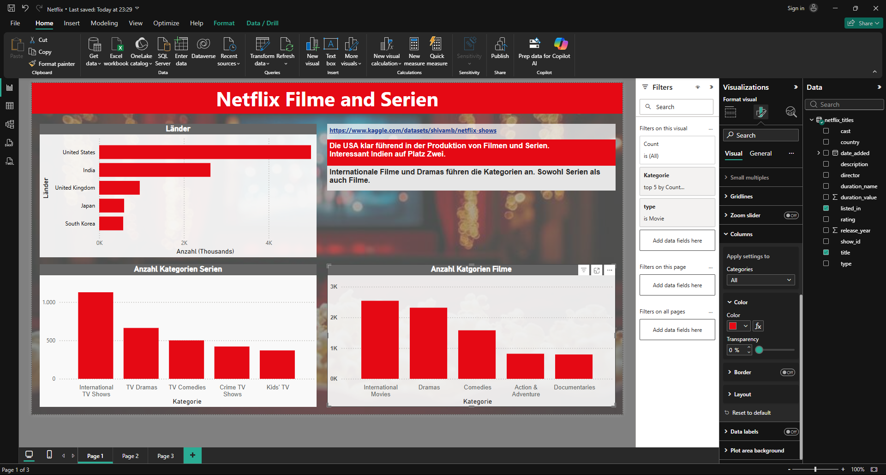

# Netflix Movies and Series: Power BI Dashboard

Ein interaktives Power BI Dashboard zur Analyse des Netflix-Katalogs: Länder, Genres, Regisseure und Altersfreigaben von Filmen und Serien.

## Projektziel

Dieses Dashboard untersucht die Zusammensetzung des Netflix-Katalogs anhand mehrerer Dimensionen:

- Welche Länder produzieren die meisten Titel?
- Welche Genres (Kategorien) sind am häufigsten bzw. am seltensten vertreten?
- Wie unterscheiden sich Filme und Serien in ihrer Genre-Verteilung?
- Wie ist die Altersfreigabe (Parental Guidelines) verteilt?
- Wer sind die aktivsten Regisseure im Katalog?

## Datenquelle

[Netflix Movies and TV Shows Dataset](https://www.kaggle.com/datasets/shivamb/netflix-shows) von Kaggle (shivamb), ca. 8.800 Titel mit Feldern wie Titel, Regisseur, Cast, Land, Erscheinungsjahr, Altersfreigabe, Dauer und Genre-Tags (`listed_in`). Die Daten wurden ursprünglich von Flixable, einer Drittanbieter-Suchmaschine für den Netflix-Katalog, zusammengestellt. Dadurch können vereinzelt Datenqualitätsprobleme auftreten, zum Beispiel eine Zeile mit fehlerhaft zugeordnetem Typ-Feld. Unklar bleibt zudem, welchen regionalen Netflix-Katalog die Daten genau abbilden, da Netflix je nach Land unterschiedliche Kataloge zeigt.

## Verwendete Techniken

**Power Query (Datenaufbereitung)**

- Bereinigung leerer/fehlerhafter Werte, zum Beispiel fehlende Länderangaben und eine fehlerhafte Zeile mit verschobenen Spaltenwerten
- Aufsplitten der mehrwertigen `listed_in`-Spalte (kommagetrennte Genre-Liste) in einzelne Zeilen für eine korrekte Genre-Auswertung
- Trimmen von Leerzeichen zur Vermeidung doppelter Kategorien, zum Beispiel "Dramas" vs. " Dramas"

**Visualisierung**

- Balkendiagramme mit Top-N- und Bottom-N-Filterung für häufigste und seltenste Genres
- Gruppierte Balkendiagramme zur Trennung von Film- und Serien-Kategorien
- Donut-Diagramm mit abgestuftem Rot-Farbverlauf für die Regisseursverteilung
- Getrennte Auswertungen für Filme (MPAA-Ratings) und Serien (TV Parental Guidelines), da beide unterschiedliche Bewertungssysteme nutzen
- Kontextuelle Insight-Textboxen zur Einordnung der wichtigsten Erkenntnisse

## Wichtige Erkenntnisse

- Die USA und Indien dominieren die Produktion klar vor UK, Japan und Südkorea.
- Internationale Filme und Dramen führen die Genre-Verteilung an, sowohl bei Serien als auch bei Filmen.
- Genre-Tags sind größtenteils typ-spezifisch. Die meisten Kategorien tauchen fast ausschließlich entweder bei Filmen oder bei Serien auf.
- Titel mit Freigabe "Ab 17 Jahren" (TV-MA bei Serien, R bei Filmen) bilden jeweils die größte Gruppe im Katalog, deutlich vor familienfreundlicheren Einstufungen.

## Aufbau des Reports

| Seite  | Inhalt                                                                                          |
| ------ | ----------------------------------------------------------------------------------------------- |
| Page 1 | Länder-Verteilung, Top-Kategorien getrennt nach Filmen und Serien                               |
| Page 2 | Altersfreigaben (TV Parental Guidelines & MPAA) mit Legenden-Tabellen, älteste Filme und Serien |
| Page 3 | Regisseure (Donut-Diagramm), seltenste Kategorien (Bottom 5)                                    |

## Hinweis

Die `.pbix`-Datei kann mit [Power BI Desktop](https://powerbi.microsoft.com/desktop/) (kostenlos, Windows) geöffnet werden. Für einen schnellen Überblick ohne Installation siehe die Screenshots bzw. den PDF-Export in diesem Repository.
